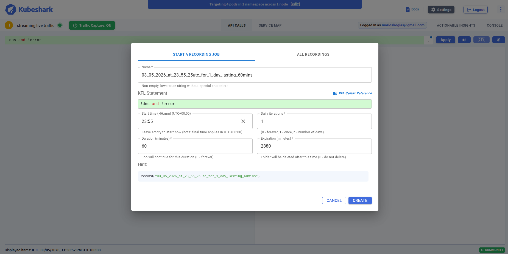
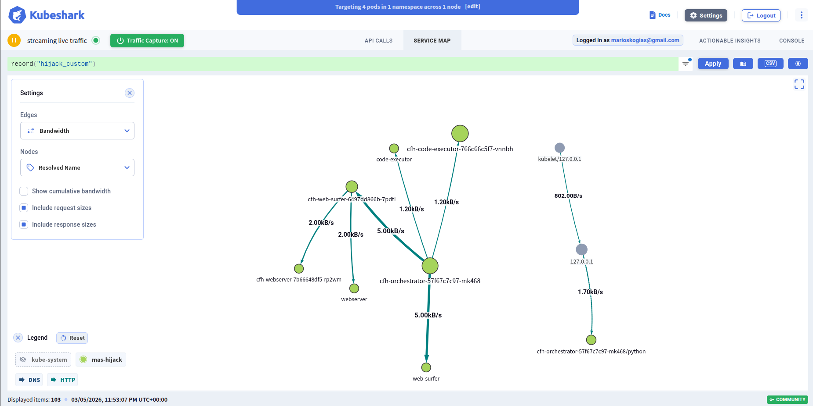
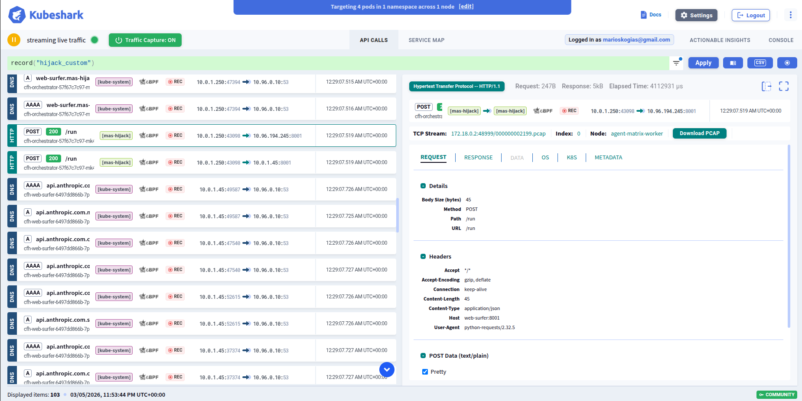

# AgentMatrix Workflow Guide

This guide describes the intended AgentMatrix workflow: prepare an isolated Kubernetes environment, capture a recording session while agents interact, and analyze the resulting traffic to understand behavior, protocol flow, and possible attacks.

The repository currently provides the infrastructure and observability side of that workflow. Agent implementations can be simple demo services, custom containers, or framework-based agents running over MCP, A2A, or other HTTP-based protocols.

## Workflow Overview

AgentMatrix is built around three phases:

1. Start a recording session.
2. Run the agent interaction.
3. Observe and study the interaction.

In practice, that means:

1. Prepare the local Kubernetes cluster and networking stack.
2. Deploy the workloads you want to study.
3. Start packet capture with Kubeshark.
4. Trigger the agent behavior or wait for it to occur.
5. Inspect flows and payloads in Kubeshark.
6. Export and post-process captures for deeper analysis.

## Phase 1: Prepare the Environment

Install the local prerequisites described in [setup.md](setup.md), then create the cluster and install Cilium:

```bash
scripts/prepare-cluster.sh
```

This script creates a local `kind` cluster named `agent-matrix` if one does not already exist.

After that, deploy the workloads you want to observe. For example:

```bash
kubectl apply -f deploy/
```

The sample manifests create:

- an `agents` namespace
- a `demo-server` HTTP service
- a `demo-client` deployment that continuously sends JSON requests to that service

For a real experiment, this is the point where you would deploy your own agent containers instead of, or alongside, the demo manifests.

## Phase 2: Start a Recording Session

Install Kubeshark:

```bash
scripts/install-kubeshark.sh
```

Expose the Kubeshark UI locally:

```bash
scripts/run-kubeshark.sh
```

By default, this forwards the Kubeshark frontend to `http://0.0.0.0:8899`.

Once Kubeshark is reachable, start a recording session from the UI before you trigger the workflow you want to inspect as seen in the picture below.
Pick a name for your recording. Leave the start time empty such that the recording start immediately and configure the recording duration.




## Phase 3: Run the Agent Interaction

This phase depends on the application you are studying.

Possible patterns include:

- a client or orchestrator sends a request to another agent
- agents begin processing immediately on startup
- a user, script, or external service triggers the workflow
- an attack or defense scenario is injected into the environment

With the sample manifests in this repository, the interaction is automatic: `demo-client` continually sends JSON payloads to `demo-server`, so traffic appears as soon as the workloads are running.

With a real multi-agent system, you would replace that with your own trigger. For example:

- invoke an orchestrator with a prompt
- send an MCP or A2A request into the system
- expose a tool or web endpoint that agents will call
- serve adversarial content from a controlled service to test attack behavior

The key requirement is that the interaction happens while Kubeshark is recording.

## Phase 4: Observe the Interaction

Kubeshark is the first place to inspect the run.

Typical questions to answer during inspection:

- Is there communication between agent X and agent Y?
- Does the communication follow the expected order?
- Are the request and response payloads what you expected?
- Is sensitive information being sent where it should not be?
- Are retries, loops, or unexpected side effects appearing in the flow?

AgentMatrix is especially useful when you care about the network view of agent systems rather than only application logs. It lets you inspect what was actually transmitted between containers and services.

The pictures below show the two main interfaces KubeShark offers. In the first one, you can observe the entire communication graph. In the second one, you can inspect individual requests and explore their fields.




The main observation view lets you follow service-to-service flows and inspect individual exchanges while the system is running.

## Phase 5: Export and Analyze Captures

For deeper analysis, collect the packet captures associated with a Kubeshark recording:

```bash
scripts/collect-kubeshark-recording-pcap.sh <recording-id>
```

This script locates matching PCAP fragments on Kubeshark worker pods and merges them into a single `.pcap` file using `mergecap`.

From there, analysis can continue in tools such as:

- Wireshark for packet-level inspection
- pandas or notebooks for structured analysis and repeatable queries

The repository already includes [parse-pcap-to-dataframe.ipynb](../scripts/parse-pcap-to-dataframe.ipynb) as a starting point for notebook-based analysis.
